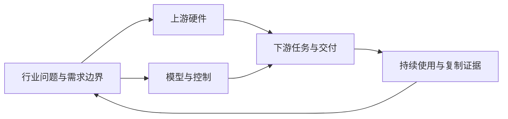

# 人形机器人产业研究

**从技术能力到客户任务，再到可靠交付和规模复制。**

本仓库持续研究人形机器人及相关移动操作产业，沿着行业总览、上游硬件、模型与控制、下游应用、持续跟踪五个模块展开。当前已有行业总览、模型行业研究，以及协作厂商向人形整机厂商供臂的逻辑专题；其他硬件方向和下游应用已建立研究提纲。本期不包含估值及盈利预测。

资料基准：**2026-09-27**。后续每份专题单独标注资料截止日，结构更新不等于全部资料已重新核实。

## 从这里开始

| 模块 | 核心问题 | 当前内容 | 状态 |
|---|---|---|---|
| [00 行业总览](00_overview/README.md) | 行业到哪了，需求和约束是什么？ | [完整行业报告](00_overview/industry-report.md)：阶段、场景、市场空间、产业链与商业验证 | 已有报告 |
| [01 上游硬件](01_hardware/README.md) | 哪些部件决定能力、寿命和批量交付，OEM如何采购？ | [协作厂商供臂逻辑](01_hardware/arms-and-oem-sourcing.md)；其他部件研究提纲 | 已有供臂专题，其他方向待开展 |
| [02 模型与控制](02_models/README.md) | 智能能力如何形成，能否减少适配与接管？ | [完整模型报告](02_models/model-report.md)：PI、Figure、DeepMind 主线及竞争参照 | 已有报告 |
| [03 下游应用](03_applications/README.md) | 哪些任务有人购买、能够验收和复制？ | 制造、物流、商业服务、家庭及科研用途的研究提纲 | 待开展专题 |
| [04 持续跟踪](04_tracking/README.md) | 哪些新证据足以改变判断？ | 指标定义、证据缺口和待验证问题 | 已建立框架，持续补证 |

**第一次阅读：** 先读[行业报告的核心判断](00_overview/industry-report.md#summary)，再读[模型路线比较](02_models/model-report.md#comparison)，最后看[当前待验证问题](04_tracking/questions.md)。完整组织逻辑见[研究地图](research-map.md)。

## 已有研究如何衔接

行业报告回答“人形机器人作为产品和产业能否成立”；模型报告深入回答“其中的智能能力由谁提供、怎样形成壁垒、怎样交付”。两者不是两份可以相加的市场规模统计。

行业总览保留整机和应用全景。模型模块承接具体架构、训练数据、能力评测及智能服务。[机械臂供货专题](01_hardware/arms-and-oem-sourcing.md)从OEM采购出发，研究自研、采购关节和采购整臂的分工，并连接模型控制接口与采集设备需求。后续硬件和应用专题继续深化相应环节，关键结论反馈到总览和跟踪页。

## 按问题查找

| 想了解什么 | 阅读位置 |
|---|---|
| 出货增长是否意味着生产用途已经成熟？ | [行业阶段](00_overview/industry-report.md#lifecycle) |
| 双足、轮式、夹爪和灵巧手如何取舍？ | [系统前提](00_overview/industry-report.md#technology) → [硬件研究提纲](01_hardware/README.md) |
| 协作厂商如何获得人形整机增长带来的订单？ | [OEM采购路径](01_hardware/arms-and-oem-sourcing.md#sourcing) → [需求传导与统计口径](01_hardware/arms-and-oem-sourcing.md#demand) |
| PI、Figure、DeepMind 分别在解决什么？ | [模型演进](02_models/model-report.md#evolution) → [路线比较](02_models/model-report.md#comparison) |
| 为什么不能直接给三家成功率排名？ | [能力证据与六维比较](02_models/model-report.md#evidence) |
| 人类视频、真机数据、仿真与经验学习如何分工？ | [模型技术路线](02_models/model-report.md#technology) |
| 整机、零部件、模型与服务的市场规模如何区分？ | [统计边界](research-map.md#market-boundaries) |
| 工厂、仓库、家庭应从哪些任务开始研究？ | [应用研究提纲](03_applications/README.md) |
| 下一轮专家访谈和资料收集应问什么？ | [待验证问题](04_tracking/questions.md) · [模型访谈重点](02_models/model-report.md#bottlenecks) |

## 后续内容放在哪里

新增研究按产业问题归档，公司作为各专题中的比较对象。例如，Figure 的模型进入模型模块，执行器设计进入硬件专题，客户现场作业进入应用专题；通过链接互相引用，不重复维护多份同一数据。

专题足够完整后再增加独立文件或子目录。现阶段保留五个稳定模块，不为每家企业、每个零部件提前建立空文件夹。

研究约定：[方法与证据标准](research-method.md) · [公开来源索引](references/README.md) · [硬件专题模板](templates/hardware-topic.md) · [应用专题模板](templates/application-topic.md) · [证据记录模板](templates/evidence-record.md) · [更新记录](CHANGELOG.md)
